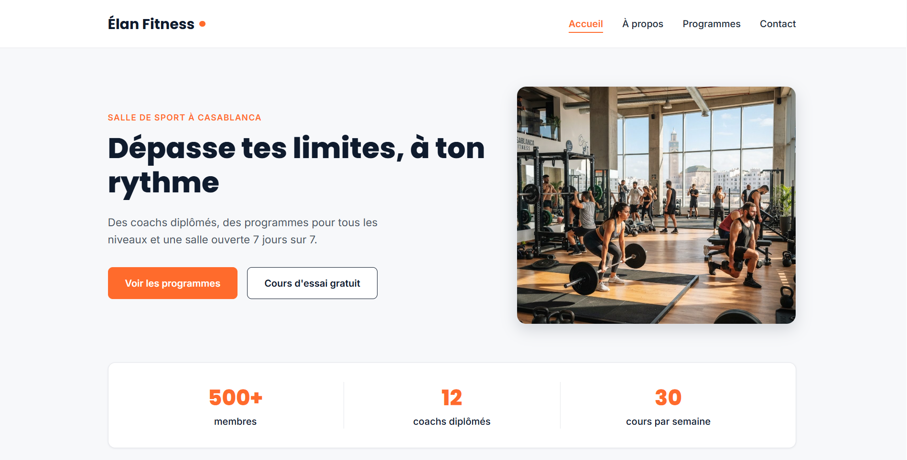

Élan Fitness – Site Web Multipage
📌 Présentation du projet

Élan Fitness est un projet d'intégration web dont l'objectif est de transformer un site web One Page en un site web Multipage.

Le site permet aux visiteurs de découvrir la salle de sport, de consulter les programmes proposés, d'en apprendre davantage sur l'entreprise et de contacter son équipe.

Ce projet a été réalisé dans le cadre d'un exercice pratique visant à renforcer mes compétences en développement front-end avec HTML5 et CSS3.

## 🖥️ Aperçu du projet

[🌐 Visiter le site en ligne](https://anassaouji.github.io/Brief_Am-lioration-d-un-site-web-de-Fitness/)

🎯 Objectifs du projet
Transformer un site One Page en un site Multipage.
Organiser le contenu dans plusieurs pages distinctes.
Créer une navigation simple et cohérente.
Utiliser les balises HTML sémantiques.
Concevoir une interface moderne et agréable.
Adapter le site aux ordinateurs, aux tablettes et aux téléphones.
Respecter les bonnes pratiques d'accessibilité et de référencement naturel (SEO).
Utiliser Git et GitHub pour gérer et partager le projet.
📄 Pages du site
Accueil (index.html) : présentation de la salle et accès aux principales sections du site.
Programmes (programmes.html) : présentation des cours, des activités sportives et des formules proposées.
À propos (apropos.html) : présentation de l'histoire, des valeurs et de l'équipe d'Élan Fitness.
Contact (contact.html) : formulaire de contact, coordonnées et informations d'accès à la salle.
📚 Documentation des acquis
1. HTML5

Pendant ce projet, j'ai appris à :

Structurer une page web avec html, head et body.
Utiliser les balises sémantiques : header, nav, main, section, article, aside et footer.
Organiser le contenu avec les titres h1, h2, h3, les paragraphes et les listes.
Ajouter des images avec img et utiliser l'attribut alt.
Créer des liens internes et relier plusieurs pages HTML.
Créer des formulaires avec form, label, input, textarea et button.
Utiliser les attributs href, src, class, id et required.
Organiser correctement le code HTML pour améliorer sa lisibilité et sa maintenance.
2. CSS3

J'ai appris à :

Séparer la structure HTML de la présentation CSS.
Utiliser les sélecteurs CSS : éléments, classes et identifiants.
Comprendre le modèle de boîte (Box Model) : margin, padding, border et width.
Gérer les couleurs, les arrière-plans, les polices et les tailles de texte.
Organiser les éléments avec Flexbox.
Créer des mises en page avec CSS Grid lorsque nécessaire.
Utiliser les propriétés display, position, gap, justify-content et align-items.
Styliser les boutons, les liens, les formulaires et les cartes.
Ajouter des effets visuels avec transition, transform et :hover.
Réutiliser les mêmes styles pour conserver une identité visuelle cohérente entre les pages.
3. Responsive Design

J'ai appris à adapter une interface à différentes tailles d'écran grâce aux media queries.

Les points de rupture utilisés dans le projet sont :

Mobile : jusqu'à 767 px.
Tablette : de 768 px à 1023 px.
Petit ordinateur : de 1024 px à 1279 px.
Grand ordinateur : à partir de 1280 px.

J'ai également appris à ajuster les espacements, les tailles de texte, les images et la disposition des éléments pour améliorer l'expérience sur chaque appareil.

4. UX/UI Design

Ce projet m'a permis de comprendre l'importance de l'expérience utilisateur et de l'interface graphique.

J'ai appris à :

Organiser les informations selon leur importance.
Créer une navigation claire entre les pages.
Utiliser des boutons d'action visibles et compréhensibles.
Maintenir une cohérence graphique sur l'ensemble du site.
Améliorer la lisibilité grâce aux contrastes, aux espacements et à la typographie.
Choisir des images adaptées au contenu et à l'identité de la salle.
5. Accessibilité Web

J'ai découvert plusieurs bonnes pratiques pour rendre un site plus accessible :

Utiliser une structure HTML sémantique.
Associer chaque champ de formulaire à un label.
Ajouter un texte alternatif pertinent aux images informatives.
Vérifier les contrastes entre le texte et l'arrière-plan.
Utiliser des liens et des boutons avec des intitulés explicites.
Préserver une navigation utilisable au clavier.
Respecter une hiérarchie logique des titres.
6. Référencement naturel (SEO)

J'ai appris à appliquer plusieurs pratiques fondamentales du SEO :

Ajouter un titre pertinent avec la balise title à chaque page.
Rédiger une meta description adaptée à chaque page.
Organiser le contenu avec une hiérarchie cohérente de titres.
Utiliser des noms de fichiers et des textes alternatifs descriptifs pour les images.
Créer des liens internes entre les différentes pages.
Utiliser un HTML clair et sémantique.
7. Git et GitHub

Ce projet m'a permis de pratiquer la gestion de versions et le partage de code.

J'ai appris à :

Créer un repository GitHub.
Initialiser un projet avec Git.
Suivre les modifications apportées aux fichiers.
Enregistrer les changements avec git add et git commit.
Envoyer le code vers GitHub avec git push.
Publier un site statique avec GitHub Pages.
🛠️ Technologies utilisées
HTML5 : structure et contenu des pages.
CSS3 : mise en page, styles et responsive design.
Git : gestion des versions.
GitHub : hébergement du code source.
GitHub Pages : publication du site web.
🚀 Déploiement

Le site est destiné à être publié gratuitement avec GitHub Pages.

Repository GitHub : https://github.com/Anassaouji/Brief_Am-lioration-d-un-site-web-de-Fitness.git

Site en ligne : https://anassaouji.github.io/Brief_Am-lioration-d-un-site-web-de-Fitness/

🎓 Conclusion

La réalisation de ce projet m'a permis de mettre en pratique les bases de HTML5 et CSS3, de comprendre l'organisation d'un site web multipage et de découvrir des notions essentielles de responsive design, d'accessibilité, de SEO et de gestion de versions.

Ce travail constitue une étape importante dans mon apprentissage du développement front-end et me permet de consolider mes compétences à travers un projet concret.
